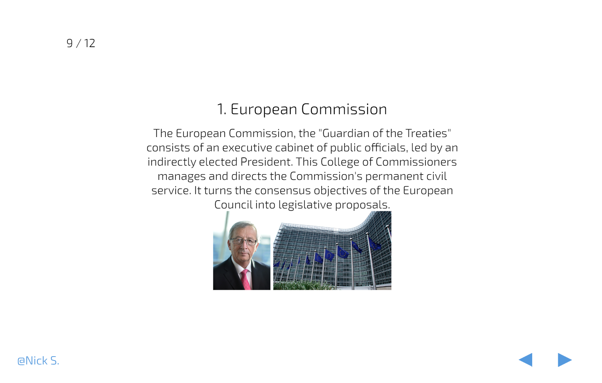

# Slideshow

---

A javascript framework to create minimalistic presentations without any additional software except a browser and a texteditor. It is designed to require
next to no design decisions when creating a presentation, while
providing your audience which the information they need to
follow your presentation.

Easily Extendable to suit your needs and optimized for speed efficiency and reliability! It is resistent towards technical difficulties which are always painful when you want to start with your presentation! No internet
connection is required to open you presentation!

## Workflow: Create

1. Create a blank html file in which your presentation information will be located.

2. Put the `script.js` file in the same directory as you newly create html file.

3. Read the documentation on how to fill your presentation
with the information you are trying to convey.

4. Open the html file in a browser of your choice!

## Workflow: Present

1. Have your html file and the `script.js` ready

2. Open the html file in a browser of your choice!

## Examples

See `examples/` to get some ideas to inspire you.

## License

Slideshow is distributed under the terms of the MIT License. All new contributions must be made under this license. See LICENSE for details.